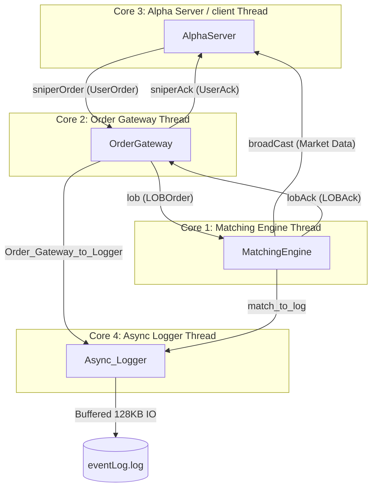

# TradeEngine: Ultra-Low Latency C++ Trading Engine

An ultra-low latency, multi-threaded C++ trading engine designed for high-throughput, deterministic execution of limit order matching. The system leverages lock-free programming, cache-aligned data structures, thread-to-core pinning (CPU affinity), custom memory allocation, and a zero-allocation asynchronous logger to achieve sub-microsecond transaction latencies.

---

## Architecture Overview

The system is structured as a pipeline of independent, single-threaded processing components communicating asynchronously via high-performance lock-free ring buffers. Each component runs on a dedicated CPU core to prevent thread context switching and cache thrashing.



### Main Components
1. **Alpha Server (`AlphaServer`)**: Simulates a high-frequency trading client/strategy (e.g., a "sniper" bot). It pre-populates and sends client orders (`UserOrder`) via a lock-free queue and receives private executions (`UserAck`) and public market data broadcasts (`BroadCast`).
2. **Order Gateway (`OrderGateway`)**: Serves as the gateway for market participants. It maps random client order IDs to dense, sequential system IDs using cache-friendly Look-Up Tables (LUTs). It validates client requests, translates them to `LOBOrder` structs, and forwards them to the matching engine.
3. **Matching Engine (`MatchingEngine`)**: Maintains the Limit Order Book (LOB) for buy and sell sides. It performs aggressive order matching, logs transactions, updates resting book state, broadcasts public price updates, and responds to the gateway with execution acknowledgments.
4. **Asynchronous Logger (`Async_Logger`)**: Operates on a background thread to drain logger queues from the matching engine and gateway. It formats and writes trace logs to `eventLog.log` without interfering with critical path latencies.

---

## Low-Latency Design Decisions & Optimizations

### 1. Single-Producer Single-Consumer Lock-Free Queues (`LFQueue`)
Traditional mutexes and condition variables introduce OS scheduler involvement, kernel transitions, and thread blocks. 
* **Design**: `LFQueue` uses a pre-allocated circular ring buffer with atomic read/write indices.
* **Zero-Copy Optimization**: Rather than copying structs through the queue, the producer calls `getNextToWriteTo()` to get a pointer to the pre-allocated slot, updates it in-place, and increments the write index. The consumer fetches the read pointer, processes it, and increments the read index.
* **Cache-Friendliness**: Eliminates dynamic allocations in the critical path and maximizes L1/L2 cache locality.

### 2. Dedicated CPU Pinning (Core Affinity)
Operating system thread schedulers frequently migrate threads across CPU cores, polluting CPU caches (L1/L2) and introducing scheduler latency spikes.
* **Design**: Utilizing `pthread_setaffinity_np` inside `Thread.h`, the engine binds the Matching Engine, Order Gateway, Alpha Server, and Logger threads to specific hardware cores. This ensures that caches stay hot and context switches are minimized.

### 3. CPU Core Pre-Warming
Modern CPUs enter low-power sleep states (C-states) or scale down frequency (P-states) when idle. Transitioning back to maximum turbo frequency can take tens of microseconds—a lifetime in high-frequency trading.
* **Design**: The system includes a hard CPU pre-warmer (`prewarmer.h`). Prior to starting the engine, it spawns busy-spinning threads pinned to all available cores, forcing the CPU governor to ramp up to its maximum turbo frequency.

### 4. High-Speed Asynchronous Logging with Custom Formatting
File and console I/O are block-level operations that are incredibly slow. Standard logging libraries call `std::to_string`, formatting streams (`std::stringstream`), or `sprintf`, all of which perform dynamic memory allocations and lock internal structures.
* **Design**: `Async_Logger` decouples logging from the critical path using dedicated lock-free logging queues.
* **Formatting Optimizations**: It implements custom, zero-allocation serialization functions:
  * `convert_u64_to_str()`: A fast, raw division/modulo character mapper.
  * `float_to_char()`: A split integer/fractional conversion to write floats.
* **Double Buffering**: Formatted elements are copied directly into a local 4KB stack buffer. When the buffer is full (or when the queue is drained), it writes the batch to the output file stream using a 128KB buffer (`pubsetbuf`).

### 5. O(1) Limit Order Book (LOB) Representation
The matching engine requires O(1) time complexity for additions, modifications, and deletions.
* **Price Indexing**: The order book indices are mapped directly to prices using a `price * 10` multiplier (accounting for a `0.1` tick size), allowing price level access in constant time.
* **Look-Up Table (LUT)**: A contiguous lookup table maps `system_id -> {price_index, column_index}`. This enables O(1) access to modify or delete resting orders without searching through the queue.
* **Soft Deletions**: Deleting an order simply marks its quantity as `0` and decrements active counts. If the best price level becomes empty, the engine glides the best price pointer (`glide_best_prize`) to the next active price level in a single pass.

### 6. O(1) Memory Pool (`MemPool`)
Dynamic memory allocation (`new` / `malloc`) utilizes heap locks and search algorithms, creating unpredictable latency (jitter).
* **Design**: The memory pool pre-allocates contiguous block storage for objects of type `T` on startup.
* **Hybrid Allocation**: It combines a high-watermark pointer for fast sequential initialization and a free-list stack to recycle deallocated block indices. This ensures both allocation and deallocation remain deterministic O(1) operations.

---

## File Structure

```
TradeEngine/
├──  CMakeLists.txt                  # Build configuration
├── main.cpp                         # System startup, thread creation, and execution loop
├── alpha_tester.cpp                 # AlphaServer test harness (client order generator)
├── doubt.md                         # Architecture notes & developer questions
├── learn.md                         # Educational notes on low-latency structures, atomics, and alignment
├── refrence.md                      # Reference links to C++ concurrency resources
├── header/
│   ├── Thread.h                     # CPU affinity thread creation wrapper
│   ├── bench.h                      # Micro-benchmarking statistics calculator
│   ├── lob_struct.h                 # Limit Order Book representation & pricing structures
│   ├── lock_free_queue.h            # Single-Producer Single-Consumer lock-free ring buffer
│   ├── logger.h                     # Async logger class & custom serialization helpers
│   ├── macros.h                     # Compiler directives, LIKELY/UNLIKELY hints, and assertions
│   ├── order_gateway_struct.h       # Gateway structures (LOBOrder, LOBAck, UserOrder, UserAck, BroadCast)
│   ├── prewarmer.h                  # Hard CPU core pre-warmer utility
├── lock_free_queue/
│   ├── LFQ_Implementation_example.cpp # Lock-free queue benchmark executable
│   ├── lfq_logger.cpp               # Logger thread lock-free queue test
│   └── outpuct_benchmark.md         # Reference benchmark execution times
├── logger/
│   ├── logger.cpp                   # Asynchronous logger tests
│   └── logger.md                    # Summary of logging design
├── matching/
│   └── matching.cpp                 # Matching Engine processing logic & aggressive execution
├── memory_pool/
│   └── memoryPool.h                 # Hybrid O(1) object memory pool
├── order_gateway/
│   └── order_gateway.cpp            # Order gateway processing & client ID translation
└── thread/
    └── example.cpp                  # Example for CPU pinned threads
```

---

## Compilation and Running

### Prerequisites
* Linux Operating System (for CPU affinity `pthread_setaffinity_np` support)
* C++17 compatible compiler (e.g., GCC 7+)
* CMake 3.10+

### Build the Project
Note: The CMake configuration has a leading space in the filename (`" CMakeLists.txt"`).

```bash
# Create and navigate to the build directory
mkdir -p build
cd build

# Generate build files using CMake
cmake ..

# Compile the executable
make
```

### Run the Trading Engine
To execute the main trading simulation (spawning the Alpha Server, Order Gateway, Matching Engine, and Async Logger on core pins 1-4):

```bash
./tradeEngine
```
The engine will execute, generate random orders, perform matching, log cycles, and output transaction traces to `eventLog.log`.

### Run Lock-Free Queue Benchmarks
To compile and test the standalone Lock-Free Queue performance:
```bash
g++ -O3 -std=c++17 -pthread lock_free_queue/LFQ_Implementation_example.cpp -o lfq_benchmark
./lfq_benchmark
```

---

## Performance Metrics

Based on internal benchmarks running on dedicated cores (results recorded in `lock_free_queue/outpuct_benchmark.md`):

| Operation | Median Latency | P75 Latency | P95 Latency | P99 Latency |
| :--- | :--- | :--- | :--- | :--- |
| **Queue Write (Producer)** | 220 ns | 346 ns | 473 ns | 624 ns |
| **Queue Read (Consumer)** | 221 ns | 319 ns | 478 ns | 799 ns |

*Latencies may vary depending on CPU clock speed, governor profile, and thread scheduling conditions.*
